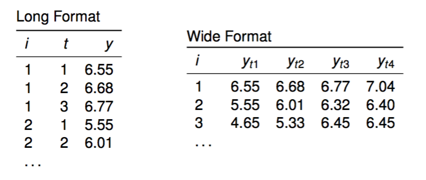

# Einführung

```{r, include=FALSE}
source("R/packages.R")
```

## Längsschnittdaten

### Begriffe {-}

* Wiederholte Querschnittserhebungen (time series cross sectional, TSCS): $n$ unabhängige Fälle (repräsentativ für dieselbe Grundgesamtheit) zu mehreren Messzeitpunkten $t$.
* Zeitreihe: Eine Einheit mit vielen Messzeitpunkten ($n = 1$, $t > 30$).
* Paneldaten: Dieselben Einheiten mit wiederholten Messungen ($n > 30$, $t \ge 2$)
    * Macro panel: $n$ klein, $t$ groß (z.B. jährliche Untersuchung von Staaten, 1950--2015)
    * Micro panel: $n$ groß, $t$ klein (typisches Befragungspanel)
* In diesem Workshop geht es um *micro panels* mit $t > 2$

### Vorteile von Paneldaten {-}

* Paneldaten erlauben die Identifikation von kausalen Effekten unter schwächeren Annahmen (im Vergleich zu Querschnittsdaten).
    * Wir haben einige (aber nicht perfekte!) Informationen über die zeitliche Abfolge von Veränderungen.
    * Wir können untersuchen, ob, und wenn ja, wie ein Ereignis (eine Veränderung eines Prädiktors) das Kriterium verändert.

* Paneldaten erlauben die Untersuchung von individuellen Verläufen

### Kausale Effekte mit Paneldaten schätzen {-}

#### Bedingungen {-}

1.  Kovariation zwischen $X$ und $Y$ (bivariate Korrelation $r_{XY}$ )
2.  $X$ muss logisch vor $Y$ liegen
3.  Keine (nicht beobachteten) Störvariablen (kein $Z$ mit kausalem Effekt auf $X$ und $Y$)

#### Herausforderungen (auch bzw. gerade mit Paneldaten) {-}

* Entsprechung der zeitlichen Entfaltung des Effekts und des Designs (Abstände, Verläufe)
* Reliabilität und Konstruktstabilität
  * Reliabilität: Bei geringer Reliabilität beobachten wir Veränderungen, die aber auf Rauschen in der Messung zurückgehen.
  * Konstruktstabilität: Wenn die Messungen über die Zeit ihre Bedeutung verändern, modellieren wir keine Veränderung des latenten Konstrukts von Interesse.
* Panelmortalität und Paneleffekte
    * Panelmortalität: Einheiten (Befragte) fallen aus, möglicherweise systematisch mit Bezug auf die Konstrukte oder Effekte, die uns interessieren.
    * Paneleffekte: Einheiten (Befragte) verändern sich durch die Messung (z.B. Lernen von Wissensfragen, Anregung durch Fragen zu Medienangeboten)

### Format von Datensätzen mit Paneldaten {-}



* Die Modelle in diesem Workshop nutzen das *long format*

* Datensätze können von einem ins andere Format transformiert werden, z.B. im `tidyverse`:
  * `tidyr::gather()` und `tidyr::spread()` (verwende ich in `R/data.R`) oder
  * `tidyr::pivot_longer()` und `tidyr::pivot_wider()`

## Beispiel-Daten


* Titel: Soziale Normen im alltäglichen Umgang mit den Konsequenzen der Corona-Krise 
* sponsored by Jule Scheper und Sophie Bruns

* Thema der Erhebung: Die Corona-Pandemie hat Regierungen auf der ganzen Welt dazu veranlasst, Reglungen zur Reduzierung der raschen Ausbreitung des Virus einzuführen. Die deutsche Bundesregierung hat am 22. März 2020 mehrere Maßnahmen zur Einschränkung sozialer Kontakte beschlossen. Diese Einschränkungen im sozialen Leben sind vollkommen neu und jede*r Einzelne muss sich auf diese Regelungen und die neue Lebenssituation einstellen. Diese Studie beschäftigt sich mit der Frage, wie Menschen sich im Alltag mit der Corona-Pandemie beschäftigen und wie sie mit den Regelungen zur Beschränkung sozialer Kontakte umgehen. Im Mittelpunkt der Untersuchung steht die Entstehung und Veränderung von sozialen Normen und persönlichen Einstellungen zur Beschränkung sozialer Kontakte über die Zeit.

* Im Rahmen des Workshops steht der Einfluss der sozialen Normen und der eigenen Einstellung zum Verhalten auf das tatsächliche Social Distancing-Verhalten im Mittelpunkt.

* Zeitraum der Erhebung: 1.4.-28.4.2020

* Datum der Messzeitpunkte: Die Befragung besteht aus vier Wellen. Jede Welle war für eine Woche im Feld und bezog sich immer auf die vorherige Kalenderwoche. 
  * Welle 1: Erhebungszeitraum vom 1.4.-7.4., Bezugszeitraum vom 23.3. bis 29.4.
  * Welle 2: Erhebungszeitraum vom 8.4.-14.4., Bezugszeitraum vom 30.3. bis 5.4.
  * Welle 3: Erhebungszeitraum vom 15.4.-21.4., Bezugszeitraum vom 6.4. bis 12.4.
  * Welle 4: Erhebungszeitraum vom 22.4.-28.4., Bezugszeitraum vom 13.4. bis 19.4.


* Nachvollziehen der Aufbereitung in `R/data.R`
* Direkt laden (z.B. für Übungen) aus `R/data/data.rds`

* Der Datensatz ist bereits im *long format*. `IDsosci` ist der Indikator für die Person, `wave` ist der Indikator für die Erhebungswelle.

### Inhaltliche Variablen im Datensatz {-}

* Alter, Geschlecht (Dummy für weiblich), Bildung und Kollektivismus sind konstante Personenmerkmale.
* Alle übrigen Variablen wurden in den vier Wellen wiederholt gemessen (mit Ausnahme von `desnorm4`, `injnorm4`, `verh4-6`, `verhint4-6`, die erst ab Welle 2 erfasst wurden).

```{r, echo=FALSE, cache=FALSE}
knitr::read_chunk("R/data.R")
```

```{r data, eval=TRUE, tidy=TRUE, message=FALSE, warning=FALSE, echo=FALSE}

```


## Pooled OLS (WRONG!)

* Als erstes Beispiel wollen wir uns einer klassischen Frage aus der Theory of Planned Behavior zuwenden. Wir interessieren uns für den Effekt der Verhaltensintention auf das (berichtete) Verhalten (schließlich würden wir zum Start des Workshops ja gerne etwas finden ;)). Konkret betrachten wir den Effekt des Vorhabens, entgegen der Empfehlungen ohne relevanten Grund die Wohnung zu verlassen, auf den Selbstbericht, dies auch zu tun. Die beiden relevanten Variablen sind `verh1` und `verhint1`. Höhere Werte bedeuten eine häufigere Ausübung des Verhaltens bzw. eine höhere Wahrscheinlichkeit, das Verhalten auszuüben (gemessen auf Skala von 1 bis 5).
* Die Abbildung zeigt die Entwicklung der beiden Variablen über die vier Wellen für 10 zufällig ausgewählte Personen.

```{r, echo=FALSE, cache=FALSE}
knitr::read_chunk("R/vis_ex1.R")
```

```{r vis-ex1, eval=TRUE, tidy=TRUE, message=FALSE}

```


* Das einfachste Modell, diesen Effekt zu schätzen, ist eine einfache OLS Regression der Verhaltensintention auf das Verhalten.

```{r, echo=FALSE, cache=FALSE}
knitr::read_chunk("R/wrong_ols.R")
```

```{r wrong-ols, eval=TRUE, tidy=TRUE, message=FALSE}

```

* Das Modell besagt, dass die Häufigkeit, ohne triftigen Grund raus zu gehen, mit jedem Punkt auf der Intentionsskala um ca. $b_{verhint1} = 0.6$ Punkte steigt.

### Warum ist Pooled OLS immer falsch? Statistische Theorie {-}

* Wir nennen dieses Modell *pooled* OLS, da alle Beobachtungen einfach zusammengeworfen werden, ohne zu beachten, dass einige von ihnen zusammen gehören, da sie von denselben Personen stammen.

1) Exogenitätsannahme ist verletzt, $E(u_i|x_i) \neq 0$
    * Korrelationen zwischen den Variablen $x$ gehen auf nicht gemessene Eigenschaften der Einheiten zurück, z.B. Eigenschaften der Person $z_i$, die sowohl $x_i$ als auch $y_i$ beeinflussen.
    * Auch bekannt als *omitted variable bias*
    * Könnte behoben werden, wenn alle $z_i$ im Modell wären; diese Idee wird später wichtig
    
1) Annahmen Homoskedastizität und unkorrelierte Residuen sind (wahrscheinlich) verletzt
    * Systematische Variation der Residuen zwischen Einheiten
    * Wahrscheinlich serielle Korrelationen durch die zeitliche Abhängigkeit der Messungen
    
1) Annahme der Unabhängigkeit der Beobachtungen verletzt
    * Überschätzung der Information von abhängigen Fällen (dieselbe Information ist mehrmals im Datensatz)
      * Zu kleine Standardfehler, zu große Zahl der Freiheitsgrade in Signifikanz-Tests
    * Die wahre Fallzahl (effective sample size) ist kleiner als Zahl der Zeilen im Datensatz (*long format*)

### Warum ist pooled OLS immer falsch? Inhaltliche Überlegungen {-}

* Unser Ziel ist es, den wahren kausalen Effekt von $X$ auf $Y$ zu schätzen.
* Pooled OLS vermischt aber zwei Quellen von Unterschieden in den Daten: Den (kausalen) Effekt innerhalb der Personen (within) und die Unterschiede zwischen Personen (between).
* Within und between Effekte können sich in Größe und sogar in der Richtung unterscheiden!
* Die Schätzung aus einem pooled OLS Modell vermischt den kausalen Effekt und die interindividuellen Unterschiede.
* In der Sprache von Interventionsstudien ist das ein Selbstselektions-Problem: Was passiert, wenn Personen, die vor dem Treatment $x$ schon höhere Werte in $y$ haben, das Treatment häufiger auswählen als Personen, die niedrig in $x$ sind?
* Außerdem fällt auf, dass im einfachen OLS Modell nichts darauf hindeutet, dass es sich um Paneldaten handelt. Selbst wenn wir die genannten Probleme nicht hätten, hätten wir auch nichts durch die Paneldaten gewonnen.

### Pooled OLS, within und between - eine Illustration {-}

* Zum Abschluss noch ein imaginäres Beispiel, um den Unterschied von intraindividuellen (within) Effekten und interindividuellen Unterschieden zu verdeutlichen. Wir führen eine Panel-Studie mit acht Personen und sechs Messzeitpunkten zum Zusammenhang von Bier-Konsum und Hangover durch. Wir interessieren uns für die kausale Frage, ob mehr Bier zu einem schlimmeren Kater führt.

```{r, eval=TRUE, include=FALSE, message=FALSE}
source("R/example_wb.R")
```

* In der pooled OLS Analyse wird einfach die Regressionsgerade durch alle Beobachtung gelegt. Es zeigt sich ein negativer Zusammenhang. Je mehr Bier konsumiert wurde, desto schwächer fällt der Hangover aus.

```{r, eval=TRUE, echo=FALSE}
plt_pool
```


* Wenn wir aber für alle acht Personen separat den Zusammenhang zwischen Bierkonsum und Kater berechnen (so genanntes no pooling Modell), ergibt sich ein anderes Bild. Für alle Personen gilt mehr oder weniger deutlich: Je mehr Bier konsumiert wurde, desto stärker fällt der Hangover aus (within).

```{r, eval=TRUE, echo=FALSE}
plt_nopool
```

* Dazu kommt ein systematischer Unterschied zwischen den Personen (between): Personen, die im Durchschnitt mehr Bier trinken, haben im Durchschnitt einen schwächeren Hangover. Dies könnte auf eine nicht beobachte Drittvariable auf Ebene der Personen zurück gehen:
  * Vielleicht trinken Personen, die wissen, dass sie nicht so anfällig für einen Hangover sind, mehr, während Personen, die immer einen starken Kater haben, schon aus Angst vor dem nächsten Tag weniger trinken.
  * Oder es ist ein Gewöhnungseffekt: Personen, die häufig viel trinken, gewöhnen sich an den Kater und nehmen ihn als weniger schlimm wahr. Oder mit Lemmy: "A kid once said to me “Do you get hangovers?” I said, “To get hangovers you have to stop drinking.""
  
* Mit den vorliegenden Daten können wir die Frage nach dem Prozess nicht beantworten, da wir die Drittvariable nicht gemessen haben. Wir können aber *alle* Variablen kontrollieren, die auf Personenebene liegen, z.B., indem wir wie in der Abbildung für jede Person ein separates Modell schätzen. Dann können Unterschiede zwischen den Einheiten per Modelldefinition keinen Einfluss auf die Schätzung haben. Etwas ähnliches passiert im *fixed effects* Modell, das wir im nächsten Abschnitt besprechen.

* An diesem Beispiel lässt sich übrigens auch schön sehen, warum uns Querschnittsdaten nicht bei der Identifikation kausaler Effekte helfen, wenn wir nicht für $Z$ kontrollieren können. Wenn wir jede Panel-Welle für sich analysieren (die Daten also als unabhängige Querschnittserhebungen behandeln), finden wir jeweils einen negativen Zusammenhang zwischen Bierkonsum und Hangover.

```{r, eval=TRUE, echo=FALSE}
plt_cross
```
